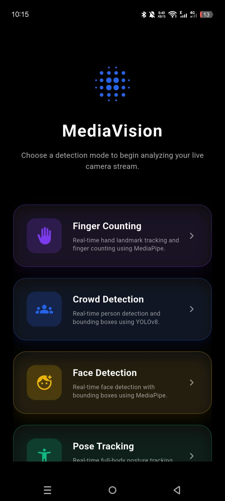

<div align="center">


<br />
<br />

<h1>MediaVision</h1>

<p><strong>A real-time, on-device machine learning app built with Flutter and a native Kotlin pipeline.</strong></p>

<p><em>No server. No internet. Just the phone.</em></p>

<br />

[Features](#features) • [Architecture](#architecture) • [Tech Stack](#tech-stack) • [Getting Started](#getting-started) • [Demo](#demo) • [Screenshots](#screenshots)

<br />

</div>

---

## Features

MediaVision demonstrates the power of on-device machine learning. By shifting all computation to a native Kotlin background pipeline, it delivers smooth, low-latency inference that feels genuinely real-time.

| | Feature | Description |
|-|---------|-------------|
| | **Crowd & Object Detector** | EfficientDet-Lite model with live bounding boxes and person counter |
| | **Face Mesh** | 468-point 3D face mesh tracking in real-time |
| | **Pose Estimation** | Full-body skeleton tracking with 33 landmarks and depth estimation |
| | **Hand & Finger Counter** | 21 hand landmarks with custom finger counting logic |
| | **Background Eraser** | Selfie segmentation with transparent PNG export, blur, gradient, and neon glow effects |
| | **Image Classifier** | Instant object categorization using EfficientNet |

---

## Architecture

MediaVision uses an asynchronous hybrid pipeline — Flutter handles the UI, Kotlin handles everything else.

```
Flutter CameraImage (YUV420)
        ↓
  MethodChannel
        ↓
Kotlin Background Executor
        ↓
Native YUV → RGB Conversion (C++ / libyuv)
        ↓
MediaPipe / TFLite Inference
        ↓
Results encoded as JPEG / PNG
        ↓
Flutter UI renders output
```

Zero network calls. Zero server dependency. Works completely offline.

---

## Tech Stack

| Category | Technology |
|----------|------------|
| **Framework** | Flutter 3.x+ |
| **State Management** | GetX |
| **Native Language** | Kotlin |
| **ML Engine** | Google MediaPipe (Native Android) |
| **Models** | EfficientDet-Lite, EfficientNet, MediaPipe Tasks |
| **Image Processing** | YuvImage, libyuv (C++ native) |
| **Bridge** | Flutter MethodChannel |
| **Architecture** | Async Hybrid Pipeline — Flutter UI + Native Multi-threaded Executor |

---

## Project Structure

```text
mediavision/
├── assets/
│   ├── icon/               # App icon
│   └── models/             # TFLite (.tflite) and MediaPipe (.task) model files
├── frontend/
│   ├── lib/
│   │   ├── controllers/    # GetX controllers for camera and ML logic
│   │   ├── screens/        # Feature screens (Crowd, Face, Eraser, etc.)
│   │   ├── services/       # MethodChannel bridge to native Android
│   │   └── main.dart       # App entry point
│   └── android/
│       └── app/src/main/kotlin/
│           ├── processors/ # Native ML processors (FaceProcessor, PoseProcessor, etc.)
│           ├── utils/      # BitmapUtils, YUV conversion utilities
│           └── MainActivity.kt  # Native bridge and thread management
```

---

## Getting Started

### Prerequisites

- Flutter SDK (latest stable)
- Android Studio or VS Code
- Physical Android device — camera features required

### 1. Clone the repository

```bash
git clone https://github.com/samimalikdev/mediavision
cd mediavision
```

### 2. Install dependencies

```bash
flutter pub get
```

### 3. Model setup

Ensure all `.tflite` and `.task` model files are present in:
```
frontend/android/app/src/main/assets/models/
```

### 4. Run the app

```bash
flutter run --release
```

> Release mode is strongly recommended for maximum ML performance.

---

## Demo

### Full App Walkthrough

<div align="center">
  <a href="https://youtu.be/FrjL9Ry3srk?si=bREvxSXLe1wYWRog">
    
  </a>
  <p><b>Click to watch the complete feature demonstration</b></p>
  <p><i>Crowd detection, face mesh, pose estimation, hand tracking, background eraser and image classifier — all in action.</i></p>
</div>

---

## Screenshots

<p align="center">
  
</p>

---

## Limitations

- Best experienced on ARM64 devices
- ML accuracy depends on ambient lighting conditions
- CPU delegate used for maximum compatibility — GPU delegate disabled for stability on older devices

## Future Improvements

- Custom TFLite model upload support
- GPU delegate auto-detection for flagship devices
- Video recording with live ML filters

---

## License

Distributed under the MIT License. See [`LICENSE`](LICENSE) for details.

---

<div align="center">

Built from scratch. Shipped with care.

If this helped you, drop a star — it means a lot.

</div>
